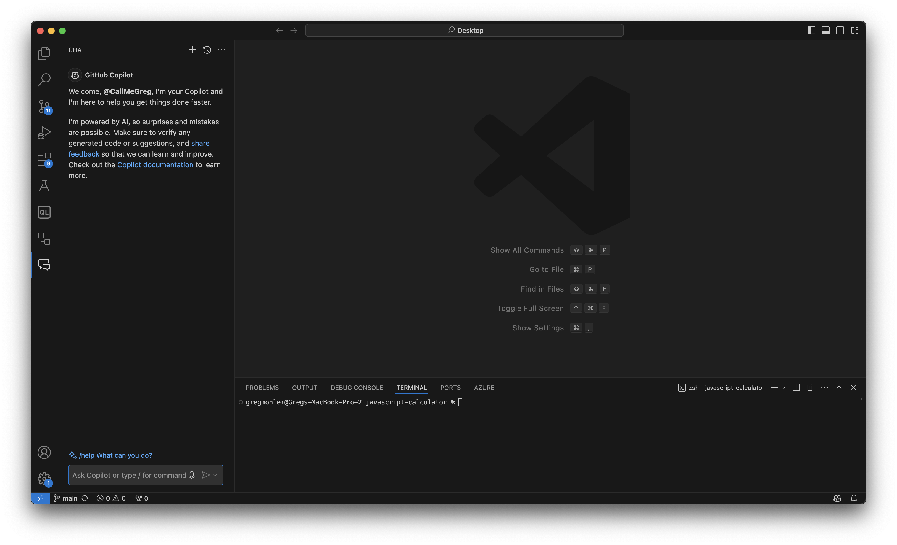
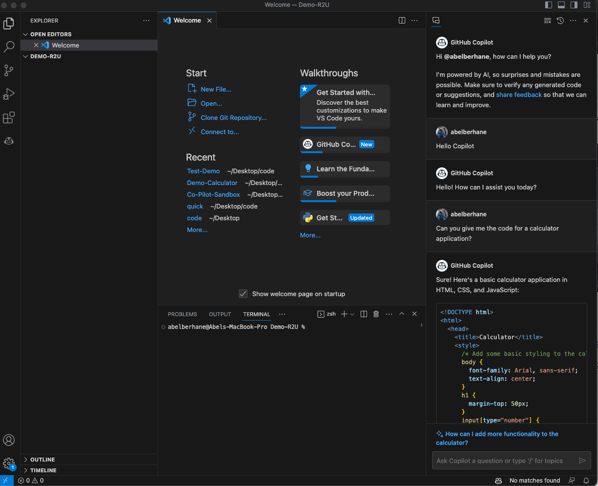
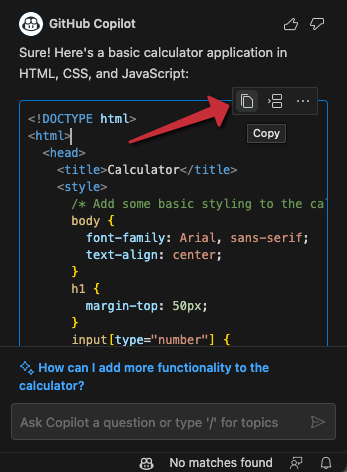
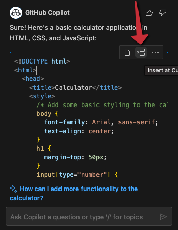
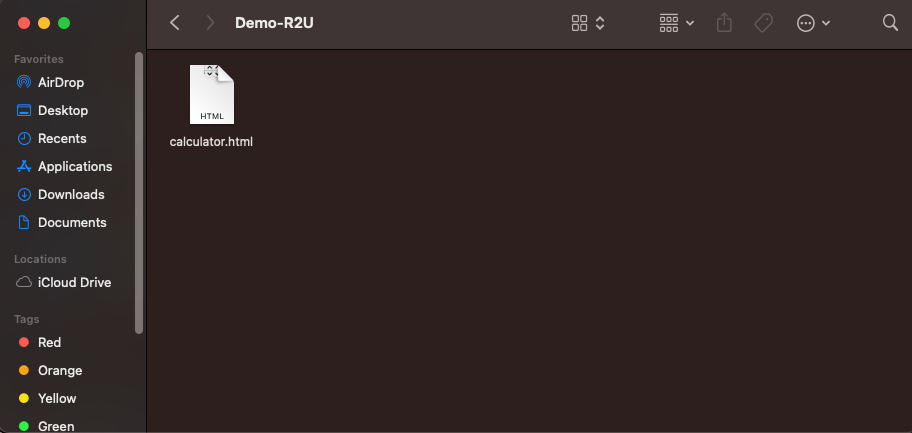
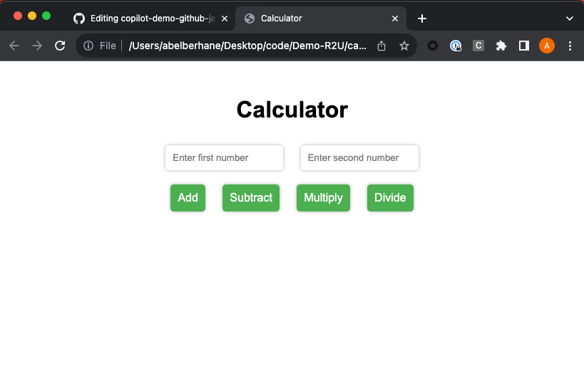
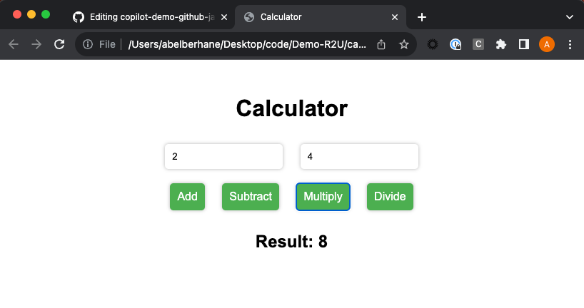

# JavaScript Calculator
<!-- REPLACE THE TITLE WITH THE NAME OF THE EXERCISE -->

This repository includes a Copilot training exercise intended to give you practical experience using the tool.

## 🎯 Goal
<!-- ONE SENTENCE ABOUT THE GOAL OF THE EXERCISE -->
Create a simple calculator using JavaScript.

## ✍️ Programming Languages
<!-- BULLETED LIST OF LANGUAGES INVOLVES -->
- JavaScript

## 💻 IDE
<!-- OPTIONALLY SPECIFY THE IDE THAT SHOULD BE USED -->
- Visual Studio
- Visual Studio Code
- JetBrains IDEs

## 🗒️ Guide
<!-- STEP BY STEP ISNTRUCTIONS DETAILING HOW TO COMPLETE THE EXERCISE -->
Welcome! In this Copilot exercise we will create a Calculator very quickly and iterate over this application with a few additional prompts.

Open your IDE of choice and navigate to the Copilot Chat extension. Make sure that your GitHub Copilot is enabled and turned on.


### Step 2: Ask GitHub Copilot Chat for assistance

In the GitHub Copilot Chat text box, provide the following prompt to solicit help from GitHub Copilot ```Can you give me code for a standard calculator written in Javascript?```. As you can see below, Copilot Chat will provide the code needed to get started.



You have 2 options of getting the code into your project. 

#### Option 1:
By clicking on the code that was generated and hovering over the top right corner, you can press the copy button to add it to your clipboard for easy pasting. Simply create the type of file you need to work with in your project and paste the generated code there.  



For this example, if we chose Option 1 we would need to create 3 files, calculator.html, calculator.js, and calculator.css. We would then paste the 3 respective generated pieces of code from GitHub Copilot Chat into each of the files. 

#### Option 2:
If you select Option 2, click into the code that was generated and hover over the top right corner once more. This time press the middle button labaled ```Insert at cursor```. This pastes the generated code into whatever file was open in your project at your cursor's location.



### Step 3: Let's run it and see what happens

Open your local directory and locate the project that you are working from. 



Double click on the ```calculator.html``` file and allow it to open in your current browser.



Enter in a few numbers and perform an operation. For this example we will do 2 multiplied by 4 and are expecting 8.



### Step 4: Further Iterations

Now that you have a working version of the application, feel free to iterate on it with any prompt that you would like. We have added a few below to provide some inspiration as to what is possible with Copilot.

> "Copilot, can we make it prettier?"

> "Copilot, can we add additional operations?"

And my personal favorite:
> "Copilot, can you show me how to add unit tests to this application?"

### Troubleshooting
There may be times where the calculator app does not work for a handful of reasons. Please review the below recommendations and hopefully it can unblock you:

- Often for this example, if copilot created 3 seperate files for the html, css, and javascript, theres a chance it places the source to the javascript file in the wrong location.

- If the application refreshes and does not calculate when pressing the calculate button, your best bet is to restart the prompt and ask it in entirely new verbiage for the same thing. Try to change as many words as possible in the prompt in an attempt to populate new code.

## 🤝 Contributing
Contributions are warmly welcomed! ✨

To contribute to a public exercise, please refer to our contribution guidelines [here](https://github.com/ps-copilot-sandbox/.github/blob/main/.github/CONTRIBUTING.md).

To create a net new exercise, please use [this repository template](https://github.com/ps-copilot-sandbox/copilot-exercise-template).
